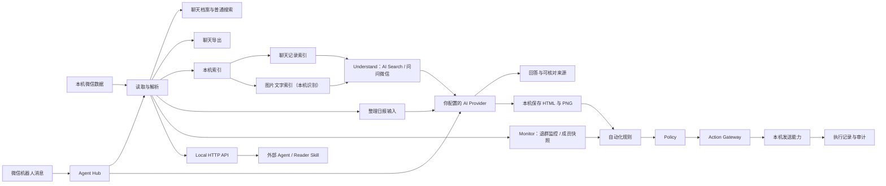

# TraceMemo 如何把聊天变成可用的信息

你可以把一次任务想成下面这条路径：



## Remember → 图片文字 → Understand → Monitor → Act

TraceMemo 的工作方式可以概括为：

```text
Remember → 图片文字 → Understand → Monitor → Act
```

- **Remember**：读取并解析本机微信数据，建立聊天档案、普通搜索和导出。
- **图片文字**：在本机识别图片里的文字，把截图、公告、报价图也变成可检索的内容。这一步不联网。
- **Understand**：Knowledge、AI Search / 问问微信、群聊日报。需要模型时，只把完成这次任务所需的受控上下文交给 Provider。
- **Monitor**：用成员快照对比发现群成员变化，产出成员退出事件。
- **Act**：自动化规则把前面的步骤串起来（定时日报、退群通知）；动作经过统一执行边界，并留下执行记录。

回答和动作结果都应能回到来源或记录核对。

## 退群监控

退群监控使用成员快照判断变化：

```text
Current Membership → Snapshot Diff → Member Event
```

上一份有效快照（Last Good Snapshot）不会被不完整读取覆盖，因此重启后仍可继续监控通知。监控关闭期间发生的变化，不会在重新开启后补报。

成员退出事件同时是「自动化」里「退群通知」规则的触发条件。

## 动作执行与审计

自动发送和监控动作经过统一边界：

```text
Feature → Policy → Gateway → Capability → Execution → Audit
```

Policy blocked 表示策略不允许，Capability unavailable 表示当前发送能力不可用，Send failed 表示已经尝试但执行失败。Action Audit / Logs 会保留执行结果；定时日报即使发送失败，也会保留已生成的报告记录。

这些动作统一由「自动化」管理，当前有三类规则：**@我生成日报**、**定时日报**、**退群通知**。发送目标支持当前群聊、文件传输助手、自己、指定好友，不是任意群发。

## 哪些步骤在本机

- 微信数据库读取与解析；
- 聊天档案浏览和普通搜索；
- Knowledge 索引与增量同步；
- 图片文字索引：识别图片中的文字完全在本机进行，原始图片不会因为本地识别而上传；
- 离线语音转写；
- 聊天导出文件、日报 HTML/PNG 和本地历史记录的保存。

## 哪些步骤可能调用外部服务

当你主动使用 AI Search、群聊日报或图片理解时，应用会把完成任务所需的受控问题和上下文发送给你配置的 Provider。它不会因为打开软件就自动上传完整数据库，本机 OCR、离线语音转写和普通搜索也不会触发外发。

Agent Hub 收到微信机器人的文字后，也可能为了理解请求或生成总结调用已配置的 Provider。Reader Skill 调用的是本机 API；外部 Agent 是否把读取结果继续交给云端模型，取决于外部 Agent 自己的配置。

如果 Provider 是 Ollama 等本机服务，请把它视为本机的另一个进程；如果是云服务，数据处理和留存规则由该服务商决定。

## 产品名词和用户任务的对应关系

| 用户想做什么                   | 产品中可能看到的名称         |
| ------------------------------ | ---------------------------- |
| 让 AI 找相关聊天               | AI Search、Retrieval         |
| 让答案能回到原消息             | Evidence、Citation           |
| 查看 AI 查找过程               | Search Trace                 |
| 让跨会话查找更稳定             | Knowledge、FTS 索引          |
| 搜到截图、公告图里写过的文字   | 图片文字索引、本机 OCR       |
| 让日报、退群通知按规则自动执行 | 自动化、Policy、执行记录     |
| 让外部 Agent 读取聊天          | Reader Skill、Local HTTP API |
| 让微信机器人调用本机能力       | Agent Hub                    |

先按任务使用，再在需要排查或开发集成时阅读术语。
